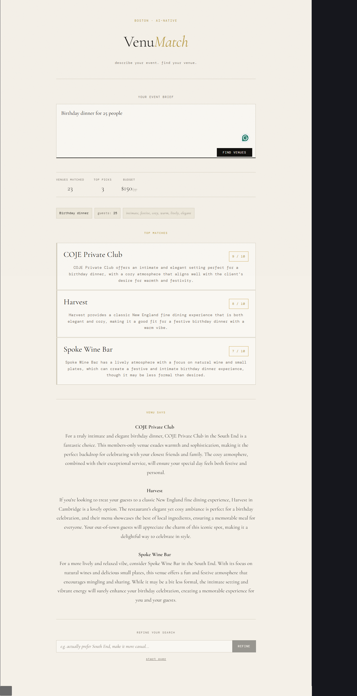

# VenuMatch

AI-native venue matching pipeline — **filter first, embed second.**

Describe an event in plain English. VenuMatch extracts a structured profile, hard-filters 25 Boston venues against real constraints, runs semantic search on only the passing venues, and returns the top 3 matches with scores, rationale, and a client-ready recommendation.

---

## How it works

```
Client Brief (plain text)
        │
        ▼
  [Intake LLM]  ──  extracts: headcount, budget/pp, neighborhood,
        │             vibe_signals, occasion, hard_constraints
        │
        ├──▶  Hard Filter (Python)
        │         drop venues that fail capacity or budget
        │         if 0 pass → widen budget 20%, retry once
        │
        ├──▶  Semantic Search (ChromaDB)
        │         embed vibe_signals only
        │         query scoped to passing venue IDs
        │
        ▼
  [LLM Ranker]  ──  scores each candidate 0-10, writes rationale
        │
        ▼
  [LLM Explainer]  ──  one client-ready recommendation paragraph per venue
        │
        ▼
  [React UI]  ──  brief input, venue cards, multi-turn refinement
```

**Why vibe-only embedding?**
Budget and headcount numbers dominate token weight in raw briefs. Extracting "moody, intimate, hidden, speakeasy" and embedding that string gives the vector search a clean signal with no numeric noise.

**Why hard filter before any LLM call?**
Capacity and budget are binary — no partial credit. Filtering first in Python means no invalid venue ever consumes tokens or reaches the ranker.

**Why ChromaDB `where=` filter instead of post-filter?**
The query is scoped to passing IDs at the ANN index level. `k` results are drawn from passing venues only — not from the full corpus. At scale this prevents top-k from being filled by eliminated venues.

---

## Tech stack

| Layer | What |
|-------|------|
| LangChain | Intake, ranker, explainer chains (`ChatOpenAI`, `JsonOutputParser`, `StrOutputParser`) |
| ChromaDB | Persistent vectorstore, cosine space, filter-aware `where=` query |
| LangGraph | `StateGraph` orchestration, budget-widen conditional edge, `MemorySaver` |
| FastAPI | REST API — `/match`, `/refine`, `/venues`, `/health` |
| React + Vite | Frontend — brief input, venue cards, refinement loop |
| Streamlit | Legacy UI — still available via `app.py` |

---

## File structure

```
venumatch/
├── api.py                        # FastAPI app — endpoints and Pydantic models
├── app.py                        # Streamlit UI (legacy)
├── main.py                       # CLI entry point
├── requirements.txt
├── environment.yml               # Conda env definition
├── Dockerfile                    # Backend container for deployment
├── .env                          # API key — gitignored
│
├── pipeline.py                   # load_venues(), normalize_brief()
├── embedder.py                   # OpenAIEmbeddings wrapper
├── vectorstore.py                # ChromaDB build/load, semantic_search()
├── retriever.py                  # hard_filter()
├── ranker.py                     # llm_rank(), llm_explain()
│
├── graph/
│   ├── state.py                  # PipelineState TypedDict
│   ├── nodes.py                  # intake, filter, widen, retrieve, rank nodes
│   ├── pipeline_graph.py         # StateGraph, run_graph(), refine_brief()
│   └── memory.py                 # MemorySaver, _sessions, merge_refinement()
│
├── prompts/
│   ├── intake.py                 # Brief normalization prompts
│   ├── scorer.py                 # Ranker prompts
│   └── explainer.py              # Client-facing explanation prompts
│
├── venumatch-ui/                 # React frontend (Vite)
│   ├── src/App.jsx               # Single-page app
│   ├── .env                      # VITE_API_URL (optional, defaults to localhost:8000)
│   └── package.json
│
└── data/
    ├── venues.json               # 25 Boston venues
    └── chroma_db/                # ChromaDB vectorstore (auto-built on first run)
```

---

## Setup

**Prerequisites:** conda, OpenAI API key

### 1. Clone the repo

```bash
git clone https://github.com/omrastogi/venumatch.git
cd venumatch
```

### 2. Create the conda environment

```bash
conda env create -f environment.yml
conda activate venuematch
```

This installs Python 3.10, all Python dependencies, and Node.js in one step.

### 3. Set your API key

```bash
echo "OPENAI_API_KEY=sk-..." > .env
```

### 4. Install React dependencies

```bash
cd venumatch-ui
npm install
cd ..
```

---

## Running VenuMatch

You need two terminals — one for the backend, one for the frontend.

### Terminal 1 — Backend (FastAPI)

```bash
conda activate venuematch
uvicorn api:app --port 8000 --reload
```

Wait for:
```
[startup] 25 venues loaded, vectorstore ready
```

### Terminal 2 — Frontend (React)

```bash
conda activate venuematch
cd venumatch-ui
npm run dev
```

Open http://localhost:5173 in your browser.

---

### Alternative — Streamlit UI (legacy)

```bash
conda activate venuematch
streamlit run app.py
```

Open http://localhost:8501.

---

### CLI mode (no UI)

```bash
# All 5 sample briefs
python main.py --mode graph

# Single brief
python main.py --mode graph --brief 1

# Phase 1 LangChain mode
python main.py --mode chain
```

Output saved to `results/output_phase2_{mode}.json`.

---

## Screenshot



---
## Deployment

### Backend — Railway

1. Push the repo to GitHub
2. Import on [railway.app](https://railway.app)
3. Set start command: `uvicorn api:app --host 0.0.0.0 --port $PORT`
4. Add env var: `OPENAI_API_KEY=sk-...`

A `Dockerfile` is included for cleaner container builds. The ChromaDB vectorstore rebuilds from `venues.json` on each cold start — fast enough for 25 venues.

### Frontend — Vercel

1. Push `venumatch-ui/` to GitHub (or as part of the monorepo)
2. Import on [vercel.com](https://vercel.com)
3. Set env var: `VITE_API_URL=https://your-railway-backend-url`
4. Deploy — Vercel auto-detects Vite

---

## API reference

Base URL: `http://localhost:8000`

All request/response bodies are JSON. All errors return `{ "detail": "..." }`.

### `GET /health`
```json
{ "status": "ok", "venues_loaded": 25 }
```

### `GET /venues`
Optional `?neighborhood=` filter. Returns array of venue objects.

### `POST /match`
```json
{ "brief": "Birthday dinner for 25. Speakeasy vibe. ~$2,000 budget." }
```
Returns `thread_id`, `profile`, `top3`, `explanation`, `passing_count`, `budget_widened`, `candidates`.

### `POST /refine`
```json
{ "thread_id": "3f8a2c1d-...", "refinement": "prefer South End, more casual" }
```
Same response shape as `/match`. Session state persists between refinements.

Full interactive docs available at `http://localhost:8000/docs`.

---

## Models

| Step | Model | Temperature |
|------|-------|-------------|
| Intake | `gpt-4o-mini` | 0 |
| Refinement | `gpt-4o-mini` | 0 |
| Ranker | `gpt-4o-mini` | 0 |
| Explainer | `gpt-4o-mini` | 0.4 |
| Embeddings | `text-embedding-3-small` | — |

---

## Cost estimate (5 briefs, full run)

| Step | Calls | Approx cost |
|------|-------|-------------|
| Venue embeddings (cached after first run) | 25 | ~$0.001 |
| Query embeddings | 5 | <$0.001 |
| Intake normalization | 5 | ~$0.01 |
| LLM ranking | 5 | ~$0.03 |
| LLM explanation | 5 | ~$0.03 |
| **Total** | | **< $0.10** |